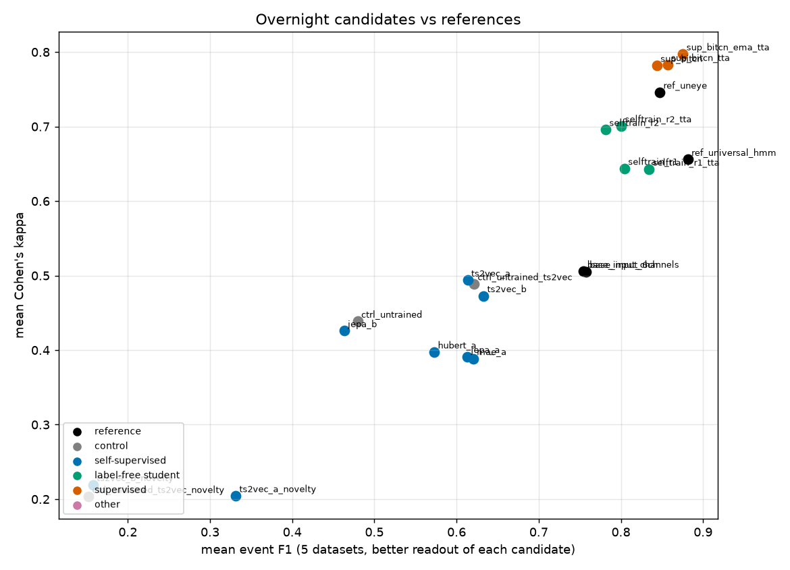
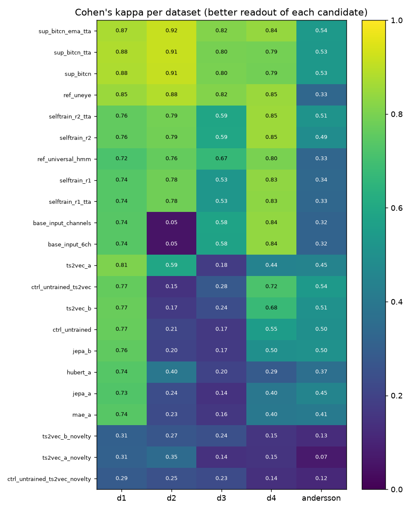
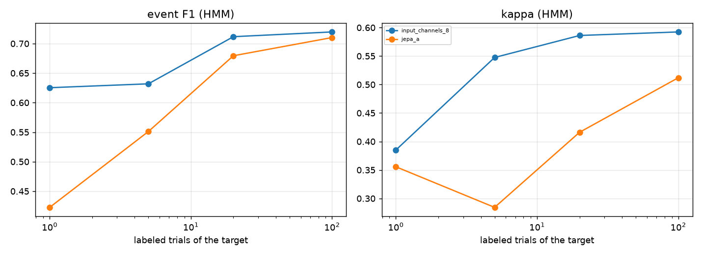

# Overnight comparison of candidate architectures and training heuristics

Generated 2026-10-10 01:22 by `foundation/night_report.py` from `foundation/runs/night/*.json` (MacBook Air M1, one GPU job at a time). The numbers are those of the files; nothing is typed by hand in the tables.

## Summary

- Best mean event F1 over the 5 benchmarks: **sup_bitcn_ema_tta** (0.88 F1, 0.80 kappa, readout: threshold); best mean kappa: **sup_bitcn_ema_tta** (0.88 / 0.80, readout: threshold).
- Reference U'n'Eye (supervised): 0.85 F1 / 0.75 kappa on the same subsets (Andersson with its general weights is 0.55 / 0.33; with its own weights 0.89 / 0.81). The label-free universal HMM: 0.88 / 0.66.
- Control: the random-initialised transformer encoder gives 0.48 / 0.44 (hmm): a trained encoder only counts if it beats this.
- Steps of the night finished: 11; failed or timed out: 0.

## Protocol (the same for every row)

- Data: the four labeled datasets of Bellet et al. 2019 and the Andersson et al. 2017 benchmark (saccade vs everything else, 1 kHz). Tested on a FIXED subset of each test split (300 trials, 60 for Andersson), scored by event F1 (a predicted run of at least 3 samples overlapping a human saccade is a hit) and Cohen's kappa (sample by sample).
- Input of every learned model: 8 velocity channels (speed, acceleration, direction change, validity, detrended speed, vx, vy), unit-free, no absolute position.
- Representations (self-supervised rows): frozen encoder -> linear score fitted on the human labels of the OTHER four datasets (leave-one-dataset-out) -> minimum-duration HMM fitted WITHOUT labels on the target's own train trials. The encoder never saw a label. 'threshold' columns use the score alone (no HMM).
- Direct rows (self-training, supervised): model score -> threshold or the same HMM decoding.
- Checkpoints and early stopping: every 500 steps a validation on labeled TRAIN splits (probe + HMM event F1); training stops after 3 evaluations without improvement; the best checkpoint is the one tested. The test subsets were never used to choose anything.

## Candidates (what is new tonight, with sources)

| id prefix | family | idea | source |
|---|---|---|---|
| `ref_uneye` | reference | U'n'Eye, original supervised U-Net (training/weights_1+2+3), offline | Bellet et al. 2019, J Neurophysiol |
| `ref_universal_hmm` | reference | minimum-duration HMM on the unit-free detrended speed, fitted on archive/ only (no label) | this work |
| `base_input_channels` | reference | plain input: 8 velocity channels -> linear probe (labels of the 4 other datasets) -> HMM | - |
| `base_input_6ch` | reference | plain input: 6 rotation-invariant channels -> same chain | - |
| `ctrl_untrained` | control | random-initialised transformer encoder (never trained) -> same chain: what a representation must beat | - |
| `ctrl_untrained_ts2vec` | control | random-initialised TS2Vec convolutional encoder -> same chain | - |
| `jepa_` | self-supervised | I-JEPA / V-JEPA in 1-D: predict in latent space the EMA-target representations of masked blocks from the context before AND after | Assran et al. 2023; Bardes et al. 2024 |
| `mae_` | self-supervised | masked autoencoder: reconstruct the masked patches of the velocity channels | He et al. 2022; Nie et al. 2023 (PatchTST) |
| `hubert_` | self-supervised | masked prediction of k-means classes of the input tokens (HuBERT iteration 1) | Hsu et al. 2021 |
| `ts2vec_` | self-supervised | hierarchical contrastive learning of a bidirectional dilated-convolution encoder, timestamp masking, overlapping crops | Yue et al. 2022 (TS2Vec) |
| `selftrain_` | label-free student | noisy-student self-training of a bidirectional TCN on the pseudo-labels of the universal HMM (labels of the benchmarks never used) | Xie et al. 2020 |
| `sup_bitcn` | supervised | bidirectional TCN trained on d1+d2+d3 labels with rotations etc., tested zero-shot on d4 and Andersson; + TTA; + EMA | Bellet 2019 (augmentation); Elmadjian et al. 2021; Zemblys et al. 2019; Startsev et al. 2019 |

Already tried before tonight (not repeated):

| attempt | outcome | source |
|---|---|---|
| seeded CEBRA, multi-session alignment (free_saccade/) | no gain over the HMM except on dataset 2 (kappa 0.52-0.75); one human saccade alone never suffices | Schneider et al. 2023 |
| DINO with a [CLS] attention map (foundation/dino1d.py) | attention anti-correlated with saccades (AUC 0.14-0.23), drift to collapse; independent noise per view did not change it | Caron et al. 2021 |
| self-supervised embedding + hyperplane chosen by physiological priors | event F1 0.54 / 0.40 / 0.45 / 0.01 / 0.37; the prior score ranks hyperplanes like the human F1 only on dataset 2 | this work |
| HMM with boundaries at a fraction of the peak speed; semi-Markov durations | kappa worse / unchanged: that line looks saturated | this work |
| I-JEPA, first setting (jepa_a) | validation event F1 0.50 (random) -> 0.625 at step 3000; below the plain input channels (0.66) | Assran et al. 2023 |

## Results (mean over the five datasets, and per dataset; event F1 / kappa)

| id | family | labels used | **best readout** F1 / kappa | readout | mean HMM F1 / kappa | mean threshold F1 / kappa | d1 | d2 | d3 | d4 | Andersson | min |
|---|---|---|---|---|---|---|---|---|---|---|---|---|
| `ref_universal_hmm` | reference | none (fitted on archive/ only) | **0.88 / 0.66** | hmm | n/a | n/a | 0.91 / 0.72 | 0.91 / 0.76 | 0.85 / 0.67 | 0.94 / 0.80 | 0.79 / 0.33 | 0.5 |
| `ref_uneye` | reference | all labels of d1+d2+d3 train splits (in-domain for d1-d3, un | **0.85 / 0.75** | hmm | n/a | n/a | 0.90 / 0.85 | 0.94 / 0.88 | 0.93 / 0.82 | 0.92 / 0.85 | 0.55 / 0.33 | 0.2 |
| `base_input_6ch` | reference | labels of the other 4 datasets (linear probe) | **0.76 / 0.51** | hmm | 0.76 / 0.51 | 0.18 / 0.26 | 0.90 / 0.74 | 0.82 / 0.05 | 0.56 / 0.58 | 0.86 / 0.84 | 0.64 / 0.32 | 0.2 |
| `base_input_channels` | reference | labels of the other 4 datasets (linear probe) | **0.75 / 0.51** | hmm | 0.75 / 0.51 | 0.17 / 0.25 | 0.90 / 0.74 | 0.81 / 0.05 | 0.57 / 0.58 | 0.86 / 0.84 | 0.64 / 0.32 | 0.2 |
| `ctrl_untrained_ts2vec` | control | labels of the other 4 datasets (linear probe only); the enco | **0.62 / 0.49** | hmm | 0.62 / 0.49 | 0.31 / 0.39 | 0.79 / 0.77 | 0.57 / 0.15 | 0.41 / 0.28 | 0.59 / 0.72 | 0.74 / 0.54 | 0.7 |
| `ctrl_untrained` | control | labels of the other 4 datasets (linear probe only); the enco | **0.48 / 0.44** | hmm | 0.48 / 0.44 | 0.29 / 0.42 | 0.79 / 0.77 | 0.44 / 0.21 | 0.19 / 0.17 | 0.37 / 0.55 | 0.61 / 0.50 | 1.7 |
| `ctrl_untrained_ts2vec_novelty` | control | none (the encoder saw no label; no probe either) | **0.15 / 0.20** | hmm | 0.15 / 0.20 | n/a | 0.16 / 0.29 | 0.17 / 0.25 | 0.17 / 0.23 | 0.10 / 0.14 | 0.15 / 0.12 | 1.4 |
| `ts2vec_b` | self-supervised | labels of the other 4 datasets (linear probe only); the enco | **0.63 / 0.47** | hmm | 0.63 / 0.47 | 0.35 / 0.42 | 0.80 / 0.77 | 0.61 / 0.17 | 0.42 / 0.24 | 0.61 / 0.68 | 0.72 / 0.51 | 10.7 |
| `mae_a` | self-supervised | labels of the other 4 datasets (linear probe only); the enco | **0.62 / 0.39** | hmm | 0.62 / 0.39 | 0.45 / 0.48 | 0.82 / 0.74 | 0.60 / 0.23 | 0.38 / 0.16 | 0.52 / 0.40 | 0.79 / 0.41 | 39.1 |
| `ts2vec_a` | self-supervised | labels of the other 4 datasets (linear probe only); the enco | **0.61 / 0.49** | hmm | 0.61 / 0.49 | 0.38 / 0.47 | 0.85 / 0.81 | 0.62 / 0.59 | 0.44 / 0.18 | 0.44 / 0.44 | 0.72 / 0.45 | 11.7 |
| `jepa_a` | self-supervised | labels of the other 4 datasets (linear probe only); the enco | **0.61 / 0.39** | hmm | 0.61 / 0.39 | 0.42 / 0.49 | 0.76 / 0.73 | 0.57 / 0.24 | 0.46 / 0.14 | 0.53 / 0.40 | 0.76 / 0.45 | 1.1 |
| `hubert_a` | self-supervised | labels of the other 4 datasets (linear probe only); the enco | **0.57 / 0.40** | hmm | 0.57 / 0.40 | 0.51 / 0.55 | 0.75 / 0.74 | 0.70 / 0.40 | 0.36 / 0.20 | 0.34 / 0.29 | 0.70 / 0.37 | 37.0 |
| `jepa_b` | self-supervised | labels of the other 4 datasets (linear probe only); the enco | **0.46 / 0.43** | hmm | 0.46 / 0.43 | 0.30 / 0.42 | 0.76 / 0.76 | 0.45 / 0.20 | 0.20 / 0.17 | 0.31 / 0.50 | 0.60 / 0.50 | 20.7 |
| `ts2vec_a_novelty` | self-supervised | none (the encoder saw no label; no probe either) | **0.33 / 0.20** | hmm | 0.33 / 0.20 | n/a | 0.34 / 0.31 | 0.45 / 0.35 | 0.29 / 0.14 | 0.20 / 0.15 | 0.38 / 0.07 | 12.4 |
| `ts2vec_b_novelty` | self-supervised | none (the encoder saw no label; no probe either) | **0.16 / 0.22** | hmm | 0.16 / 0.22 | n/a | 0.16 / 0.31 | 0.18 / 0.27 | 0.19 / 0.24 | 0.10 / 0.15 | 0.16 / 0.13 | 11.8 |
| `selftrain_r1_tta` | label-free student | none for training | **0.83 / 0.64** | threshold | 0.66 / 0.63 | 0.83 / 0.64 | 0.89 / 0.74 | 0.90 / 0.78 | 0.78 / 0.53 | 0.92 / 0.83 | 0.68 / 0.33 | 4.6 |
| `selftrain_r1` | label-free student | none for training (labeled train splits only select the chec | **0.80 / 0.64** | threshold | 0.68 / 0.64 | 0.80 / 0.64 | 0.89 / 0.74 | 0.90 / 0.78 | 0.77 / 0.53 | 0.92 / 0.83 | 0.54 / 0.34 | 4.6 |
| `selftrain_r2_tta` | label-free student | none for training | **0.80 / 0.70** | threshold | 0.61 / 0.60 | 0.80 / 0.70 | 0.88 / 0.76 | 0.87 / 0.79 | 0.78 / 0.59 | 0.87 / 0.85 | 0.60 / 0.51 | 4.6 |
| `selftrain_r2` | label-free student | none for training (labeled train splits only select the chec | **0.78 / 0.70** | threshold | 0.64 / 0.61 | 0.78 / 0.70 | 0.87 / 0.76 | 0.87 / 0.79 | 0.79 / 0.59 | 0.86 / 0.85 | 0.51 / 0.49 | 4.6 |
| `sup_bitcn_ema_tta` | supervised | labels of d1+d2+d3 train splits (d4 and Andersson never seen | **0.88 / 0.80** | threshold | 0.57 / 0.37 | 0.88 / 0.80 | 0.92 / 0.87 | 0.96 / 0.92 | 0.88 / 0.82 | 0.91 / 0.84 | 0.70 / 0.54 | 9.0 |
| `sup_bitcn_tta` | supervised | labels of d1+d2+d3 train splits (d4 and Andersson never seen | **0.86 / 0.78** | threshold | 0.61 / 0.40 | 0.86 / 0.78 | 0.90 / 0.88 | 0.95 / 0.91 | 0.90 / 0.80 | 0.83 / 0.79 | 0.70 / 0.53 | 9.0 |
| `sup_bitcn` | supervised | labels of d1+d2+d3 train splits (d4 and Andersson never seen | **0.84 / 0.78** | threshold | 0.60 / 0.40 | 0.84 / 0.78 | 0.89 / 0.88 | 0.94 / 0.91 | 0.88 / 0.80 | 0.82 / 0.79 | 0.68 / 0.53 | 9.0 |

The headline column is the better mean event F1 of the two readouts (shown separately): 'hmm' = the score decoded by the minimum-duration HMM (Gaussian emissions, which suits a probe score of a representation but not the saturated logit of a network), 'threshold' = the score alone. The per-dataset cells use that readout. For `ref_*` rows a single prediction is scored; for `*_novelty` rows only the HMM readout is meaningful.

## Label efficiency (frozen features + linear score from N labeled trials of the target, then HMM; event F1 / kappa, mean over d1, d2, d3, Andersson)

| representation | N=1 | N=5 | N=20 | N=100 |
|---|---|---|---|---|
| `input_channels_8` | 0.63 / 0.39 | 0.63 / 0.55 | 0.71 / 0.59 | 0.72 / 0.59 |
| `jepa_a` | 0.42 / 0.36 | 0.55 / 0.28 | 0.68 / 0.42 | 0.71 / 0.51 |

## Steps of the night

| step | state | minutes |
|---|---|---|
| eval_jepa_a | done | 1.2 |
| ctrl_untrained | done | 1.9 |
| ctrl_untrained_ts2vec | done | 1.9 |
| base_input_6ch | done | 0.2 |
| selftrain | done | 11.9 |
| sup_bitcn | done | 11.0 |
| ts2vec_a | done | 13.2 |
| mae_a | done | 39.4 |
| hubert_a | done | 37.2 |
| ts2vec_b | done | 12.7 |
| jepa_b | done | 20.9 |

## Limits

- One training run per configuration (seed 0): differences of a few hundredths are not significant; no confidence intervals.
- The self-supervised rows use the labels of the other four datasets in the linear probe; only the encoders are label-free. Rows trained with pseudo-labels (selftrain) use no label of any benchmark for training.
- Test subsets: 300 trials per dataset (60 for Andersson), not the full test splits.
- Hyper-parameter variations are few (lr, block length, patch size, EMA, depth / width); see `args` in each JSON.

